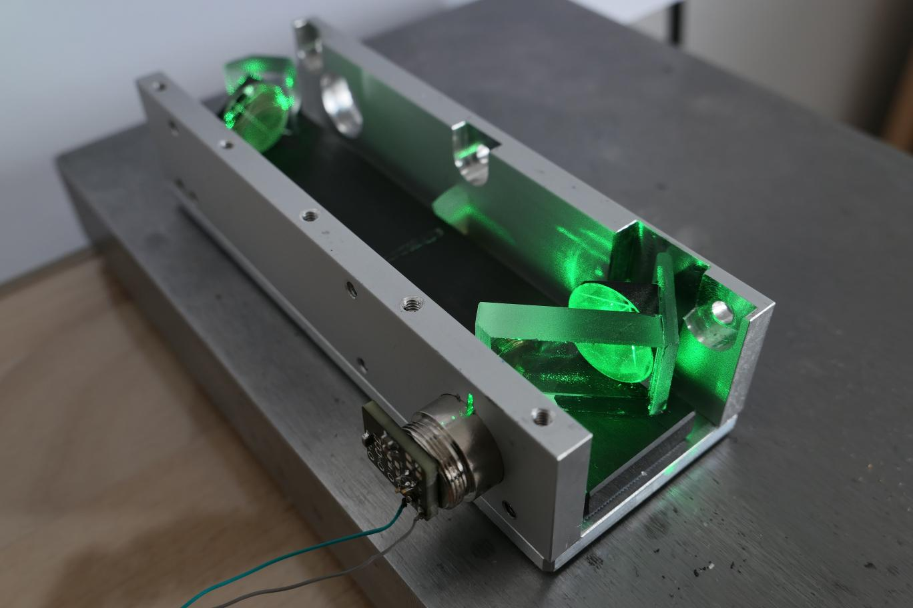
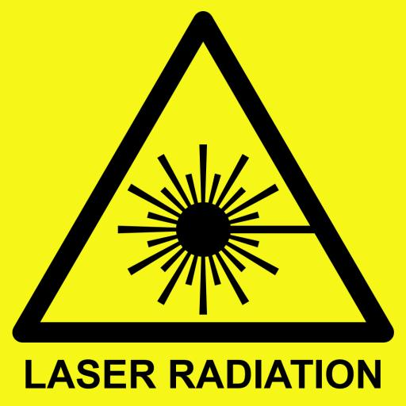

# An Open Source Interferometer for Accurate Distance Measurements

This repository is being build, please come back another time...

## Laser Safety

This project involves collimated laser beams with power levels above eye-safe limits able to cause permanent eye damage.
Please use proper precautions, do your own research, and respect laser safety guidelines.

## Laser Diodes

For this project the laser source requires a long coherence length, wich only certain laser diode models can provide.
Below is a table of laser diodes that I tested or want to test in future:

| Part Number           | Nominal Current | Optimal Drive Current | Power   | Wavelength  | Notes                                             | Plus on case |
|-----------------------|-----------------|-----------------------|---------|-------------|---------------------------------------------------|-----------|
| SLD3232VF             | 55mA            | ?                     | 50mW    | 405nm       | Not good                                          | Yes       |
| QL65E7SA              | 50mA            | 30mA                  | 7mW     | 650nm       | Good                                              | Yes       |
| QL65E7SB or C         | 50mA            | 30mA                  | 7mW     | 650nm       | Good                                              | Yes       |
| PLT520B               | 225mA           | ?                     | 110mW   | 520nm       | Very good (coherence length >4m)                  | Yes       |
| PLT5 516FA            | 100mA           | 36mA                  | 30mW    | 516nm       | (Very) good (CURRENT CHOICE FOR PROJECT)          | No        |
| PLT5 520EB_Q          | -               | ?                     | 20mW    | 520nm       | Not tested (datasheet suggests very good)         | No        |
| PLT5 450(G)B          | 80mA            | 21mA                  | 100mW   | 450nm       | Okay                                              | No        |
| PLT5 520DB            | -               | ?                     | 10mW    | 520nm       | Not tested (datasheet suggests probably not good) | No        |
| PLT5 518FB_P          | -               | ?                     | 30mW    | 518nm       | Not tested (datasheet suggests probably not good) | No        |

