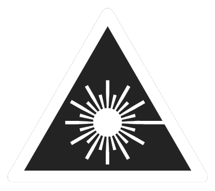

# nmWave-Interferometer
An Open Source Interferometer for Accurate Distance Measurements
This repository is being build, please come back another time...

## Laser Safety

This project involves collimated laser beams with power levels above eye-safe limits, which may cause permanent eye damage. Please use proper precautions, do your own research, and respect laser safety guidelines.

|  | This project involves collimated laser beams with power levels above eye-safe limits, which may cause permanent eye damage. Please use proper precautions, do your own research, and respect laser safety guidelines. |
|-----------------------------------------|-------------------------------------------------------------------------------------------------------------------------------------------------------------------------------|

{:style="float: left; margin-right: 15px;"}
This project involves collimated laser beams with power levels above eye-safe limits, which may cause permanent eye damage. Please use proper precautions, do your own research, and respect laser safety guidelines.

## Laser Diodes

For this project the laser source requires a long coherence length, wich only certain laser diode models can provide.
Below is a table of laser diodes that I tested or want to test in future:

| Part Number           | Nominal Current | Optimal Drive Current | Power   | Wavelength  | Notes                                           | Plus on case |
|-----------------------|-----------------|-----------------------|---------|-------------|-------------------------------------------------|-----------|
| SLD3232VF             | 55mA            | ?                     | 50mW    | 405nm       | Not good                                        | Yes       |
| QL65E7SA              | 50mA            | ?                     | 7mW     | 650nm       | Good                                            | Yes       |
| QL65E7SB or C         | 50mA            | ?                     | 7mW     | 650nm       | Good                                            | Yes       |
| PLT520B               | 225mA           | ?                     | 110mW   | 520nm       | Very good (coherence length >4m)                | Yes       |
| PLT5 516FA            | -               | ?                     | 30mW    | 516nm       | Not tested yet (datasheet suggests probably good)  | No        |
| PLT5 520EB_Q          | -               | ?                     | 20mW    | 520nm       | Not tested yet (datasheet suggests very good)      | No        |
| PLT5 450(G)B          | -               | ?                     | 100mW   | 450nm       | Not tested yet (datasheet suggests very good)       | No        |
| PLT5 520DB            | -               | ?                     | 10mW    | 520nm       | Not tested yet (datasheet suggests probably not good) | No        |
| PLT5 518FB_P          | -               | ?                     | 30mW    | 518nm       | Not tested yet (datasheet suggests probably not good) | No        |

